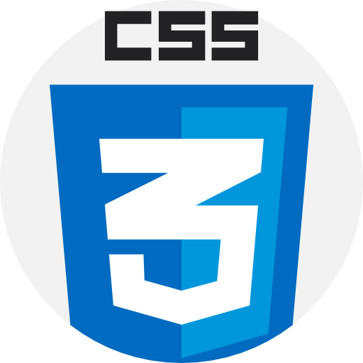
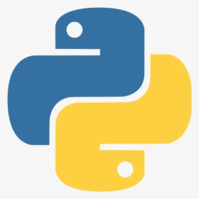

# Hi there, I'm Tejas 
## I'm Web Developer/ Great Programmer / Content Writer / Linux Lover / Investor in Stock Market
### I love to write Code ❤️

My name is Tejas Magade and I am learning in the Second Year of IT engineering. I love to code and especially I am very passionate about web development. I learned all the basics of web development and now I am learning the Django framework and Android development. I also know the C, Python, and Java programming languages. And I also love to explore new programming languages.
From my web development knowledge, I developed my own blogging website, 2 clients business websites, and I am also working on some new projects.

:chart: With that, I am really interested in Stock Market. :chart:

### Connect with me at:

 

### Languages & Tools:

 
 

### Latest Blog Posts :closed_book:
:link: <a href="https://magadetejas.medium.com/functions-in-python-a-beginners-guide-to-know-about-it-3b4271701f76">Functions in Python: A Beginner’s guide to know about it.</a> 
:link: <a href="https://programtuts.com/c-programming/hierarchy-of-operators/hierarchy-of-operators.php">Hierarchy Of Operators / Precedence of Operators</a> 
:link: <a href="https://programtuts.com/tensorflow/what_is_tensorflow/what_is_tensorflow.php">What is TensorFlow? A Beginner's Guide to Know about it.</a> 
:link: <a href="https://programtuts.com/python/weather-info/weather-info.php">Find real-time weather of any city using python & openweathermap API</a> 
:link: <a href="https://programtuts.com/java/inheritance/inheritance-in-java.php">Inheritance In Java: A Simple But Complete Guide </a> 
:link: <a href="https://programtuts.com/python/data-visualization/data-visualization-in-python.php">A Begineer's Guide to Data Visualization in Python</a> 

For, Such blog Posts & articles visit: 
:link: <a href="https://programtuts.com/">https://programtuts.com/</a> :link: 
:link: <a href="https://magadetejas.medium.com/">https://magadetejas.medium.com/</a> :link:
 

### My Client's Websites
:link: <a href="https://bit.ly/2RVUKC3">Omkar Gardner</a> 
:link: <a href="https://shaurya-security.web.app/">Shaurya Security Soln.</a>
 

### My Github Stats

 

### Random Joke

